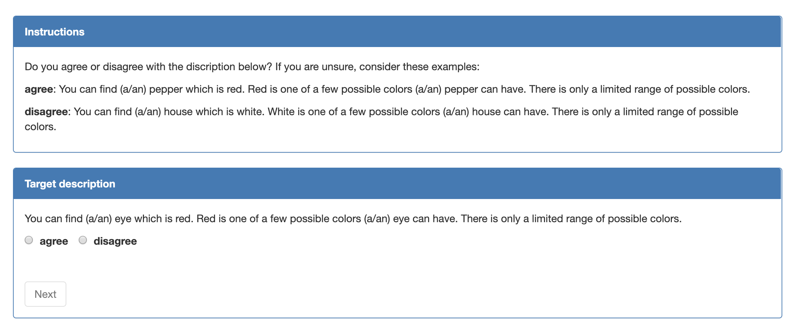

# Semantic Property Task: annotation

This repository contains code to create input for an annotation task. In this task, property-concept pairs should be annotated with semantic relations. The property-concept pairs were collected from various resources (https://github.com/cltl/semantic_property_dataset).

## Annotation task

The annotation task is set up as follows: Participants are presented with short descriptions of a relation between a property and a concept and asked to indicate whether they agree or disagree with the description.

Example of a single instance in the annotation task

We run the task using the Lingoturk framework (https://github.com/FlorianPusse/Lingoturk) and distribute it via the platform Prolific (https://www.prolific.co/).

## Code

(1) Create all questions of a run of your experiment. Each question will receive a unique identifier. Do not change them anymore.

Each question consists of:

* property
* concept
* relation
* sentence describing the concept-property-relation
* a positive example of such a relation
* a negative example of such a relation
* pos and neg example property
* pos and neg example concept
* source of the property-concept pair

To create the questions, run:

`cd scripts/`
`python create_questions.py [run number]`

Replace `[run number]` with the experiment run. Currently, I created run3. The run number determines which descriptions of relations will be used (stored in `templates/`). The examples are taken from `examples/`.

(2) Create batches of questions which have not been annotated yet as you go.

`cd scripts/`
`python create_batch.py [prolific completion-url] [test/batch]`

Replace `[prolific completion-url]` with the completion url you received from Prolific when setting up the task on the platform. Replace `[test/batch]` with either 'test' (for testing) or 'batch' (for creating a batch).

(3) Launch the task:

* Upload your input to your Lingoturk platform
* Link the task to your Prolific Task
* Publish

To download and analyze the results, please refer to: https://github.com/PiaSommerauer/SPT_crowd_data_analysis.
